# VERDANT - Allergen Scanner

A mobile-first food allergen scanner that lets you scan product barcodes and instantly find out if they contain allergens you're sensitive to. Built with React Native (Expo) and a Node.js/Express backend, deployed on Vercel.

**Live Demo:** [https://verdant-allergenscan.vercel.app](https://verdant-allergenscan.vercel.app)

---

## Screenshots

<table>
  <tr>
    <td align="center">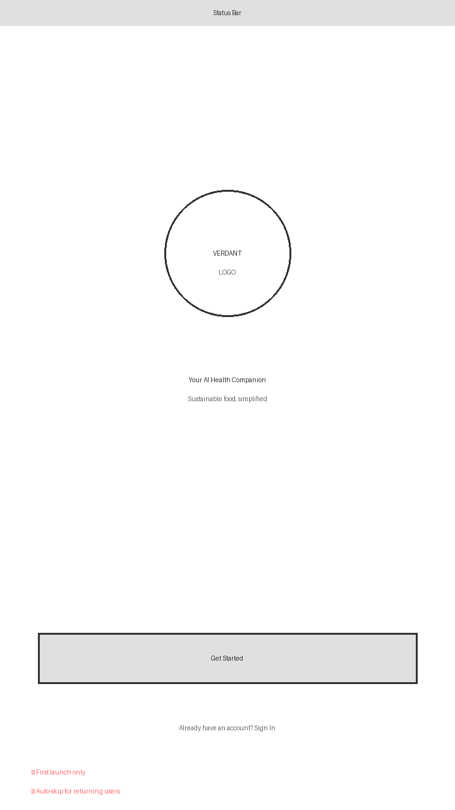<br /><b>Welcome</b></td>
    <td align="center">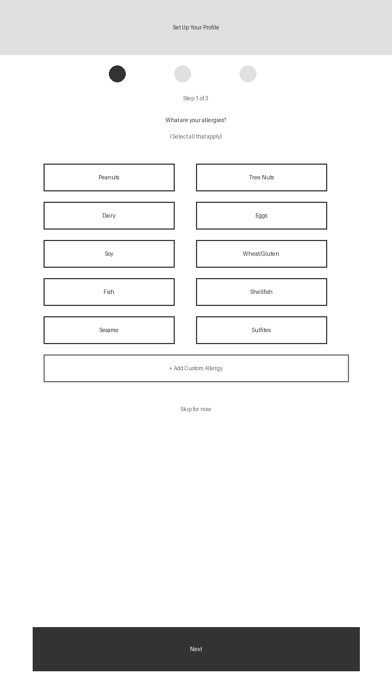<br /><b>Select Allergies</b></td>
    <td align="center">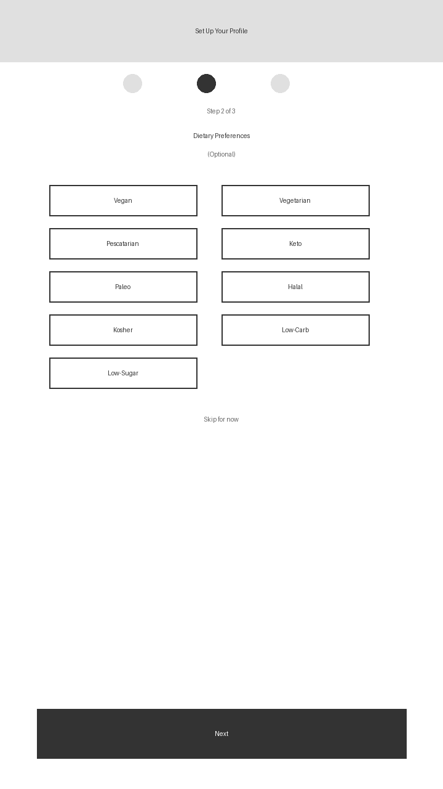<br /><b>Dietary Preferences</b></td>
    <td align="center">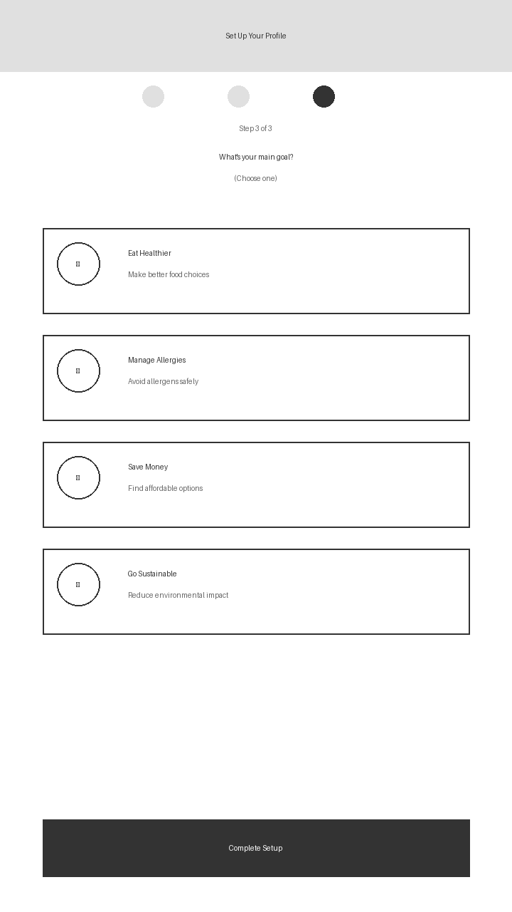<br /><b>Health Goals</b></td>
  </tr>
  <tr>
    <td align="center">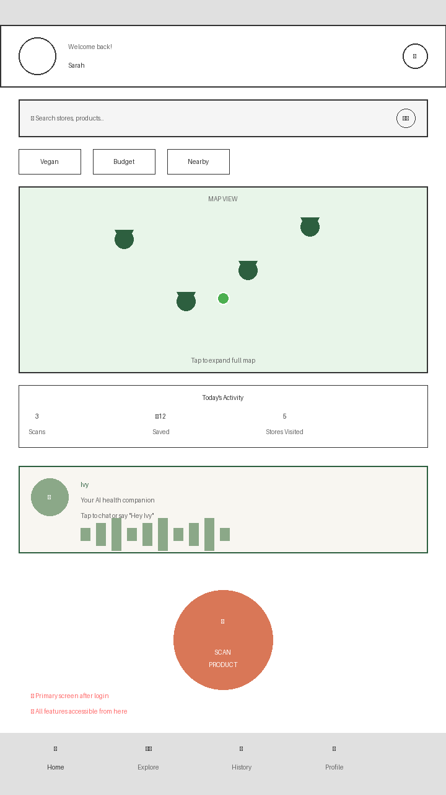<br /><b>Dashboard</b></td>
    <td align="center">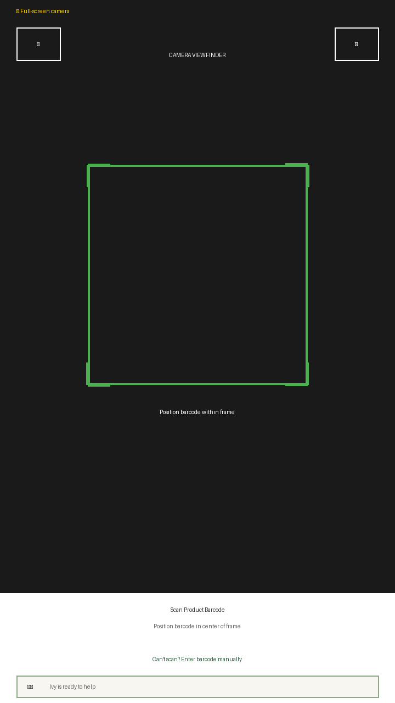<br /><b>Barcode Scanner</b></td>
    <td align="center">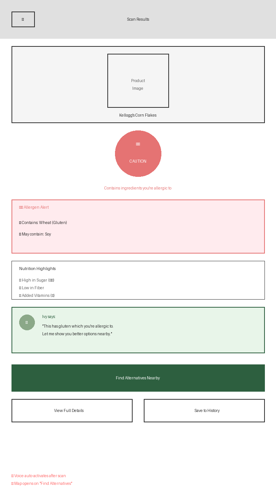<br /><b>Scan Results</b></td>
    <td align="center">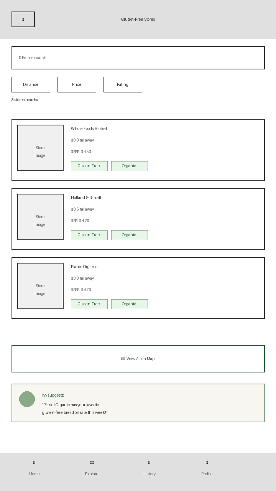<br /><b>Store Listings</b></td>
  </tr>
  <tr>
    <td align="center">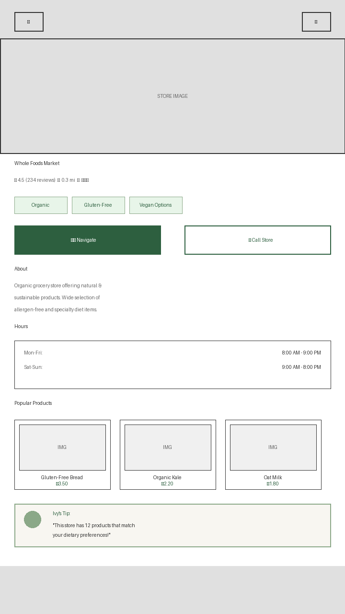<br /><b>Store Detail</b></td>
    <td align="center">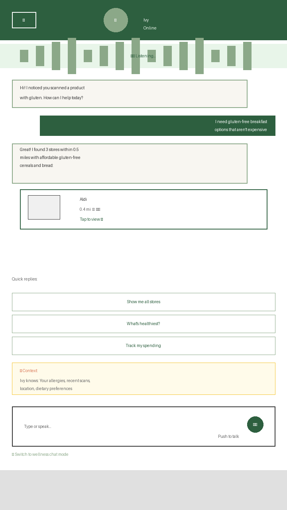<br /><b>AI Chat</b></td>
    <td align="center">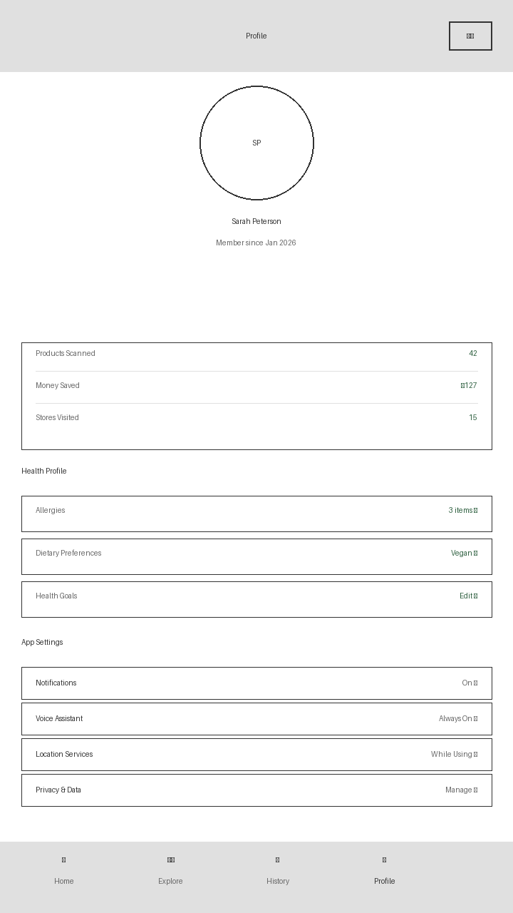<br /><b>Profile & Settings</b></td>
    <td></td>
  </tr>
</table>

---

## How It Works

1. **Sign up / Log in** with any email and password
2. **Set your allergen profile** during onboarding (e.g. Milk, Soy, Peanuts)
3. **Scan a barcode** using the camera or type it in manually
4. **Get instant results** -- the app checks real product data from [Open Food Facts](https://world.openfoodfacts.org/) and tells you if the product is safe or contains your allergens

### Risk Levels

| Level | Meaning |
|-------|---------|
| **Safe** | No allergens from your profile detected |
| **Caution** | 1 allergen match found |
| **High Risk** | 2+ allergen matches found |

---

## Tech Stack

| Layer | Technology |
|-------|-----------|
| **Frontend** | React Native, Expo SDK 54, expo-router, expo-camera |
| **Backend** | Node.js, Express.js, TypeScript |
| **Product Data** | [Open Food Facts API](https://world.openfoodfacts.org/) |
| **Deployment** | Vercel (serverless functions + static hosting) |
| **Auth** | JWT-based (mock auth for demo) |

---

## Project Structure

```
VERDANT/
├── api/                    # Vercel serverless API
│   └── index.ts            # All API routes (auth, scan, profile)
├── src/
│   └── index.ts            # Local dev Express server
├── allergy-scanner-frontend/
│   └── app/
│       ├── auth/            # Login & register screens
│       ├── onboarding/      # Allergen/dietary/goals setup
│       └── (tabs)/
│           ├── home.tsx     # Dashboard
│           ├── scan.tsx     # Barcode scanner + manual entry
│           ├── history.tsx  # Scan history
│           └── profile.tsx  # User profile & settings
├── vercel.json             # Vercel deployment config
├── package.json            # Backend dependencies
└── tsconfig.json           # TypeScript config
```

---

## Getting Started

### Prerequisites

- **Node.js** 18 or higher
- **npm** (comes with Node.js)

### 1. Clone the repo

```bash
git clone https://github.com/ShivaShanmukh/allergenscan.git
cd allergenscan
```

### 2. Install backend dependencies

```bash
npm install
```

### 3. Install frontend dependencies

```bash
cd allergy-scanner-frontend
npm install
```

### 4. Run the backend (local dev)

```bash
# From the root directory
npm run dev
```

The API server starts at `http://localhost:4000`.

### 5. Run the frontend

```bash
# From allergy-scanner-frontend/
npx expo start --web
```

Open `http://localhost:8081` in your browser.

---

## API Endpoints

| Method | Endpoint | Description |
|--------|----------|-------------|
| `POST` | `/api/auth/login` | Log in with email & password |
| `POST` | `/api/auth/register` | Register a new account |
| `GET` | `/api/me` | Get current user info |
| `POST` | `/api/scan` | Scan a barcode (returns allergen analysis) |
| `GET` | `/api/scan/history` | Get scan history |
| `GET` | `/api/profile/allergens` | Get user's allergen profile |
| `PUT` | `/api/profile/allergens` | Update allergen selections |
| `GET` | `/api/profile/dietary` | Get dietary preferences |
| `PUT` | `/api/profile/dietary` | Update dietary preferences |
| `GET` | `/api/profile/goals` | Get health goals |
| `PUT` | `/api/profile/goals` | Update health goals |
| `GET` | `/api/health` | Health check |

### Example: Scan a product

```bash
curl -X POST https://verdant-allergenscan.vercel.app/api/scan \
  -H "Content-Type: application/json" \
  -d '{"barcode": "3017620422003"}'
```

Response:

```json
{
  "product": {
    "name": "Nutella",
    "brand": "Ferrero",
    "ingredients": "Sugar, palm oil, hazelnuts 13%, ...",
    "imageUrl": "https://..."
  },
  "allergenWarnings": [
    { "id": 3, "name": "Milk" },
    { "id": 6, "name": "Soy" }
  ],
  "safe": false,
  "riskLevel": "high",
  "source": "openfoodfacts"
}
```

---

## Try These Barcodes

| Barcode | Product | Expected Result |
|---------|---------|----------------|
| `3017620422003` | Nutella | **High Risk** (Milk, Soy) |
| `3017760000109` | LU Prince Chocolat | **Safe** |
| `3175681851849` | Gerblé Biscuit | **Caution** (Milk) |
| `5000159461122` | Cadbury Dairy Milk | **High Risk** (Milk) |
| `7622210449283` | Oreo Original | **Caution** (Soy) |

---

## Deployment

The app is deployed on **Vercel** automatically. To deploy your own:

1. Install the Vercel CLI: `npm i -g vercel`
2. Run `vercel login`
3. From the project root: `vercel --prod`

The `vercel.json` handles both the frontend build and API routing.

---

## License

MIT
